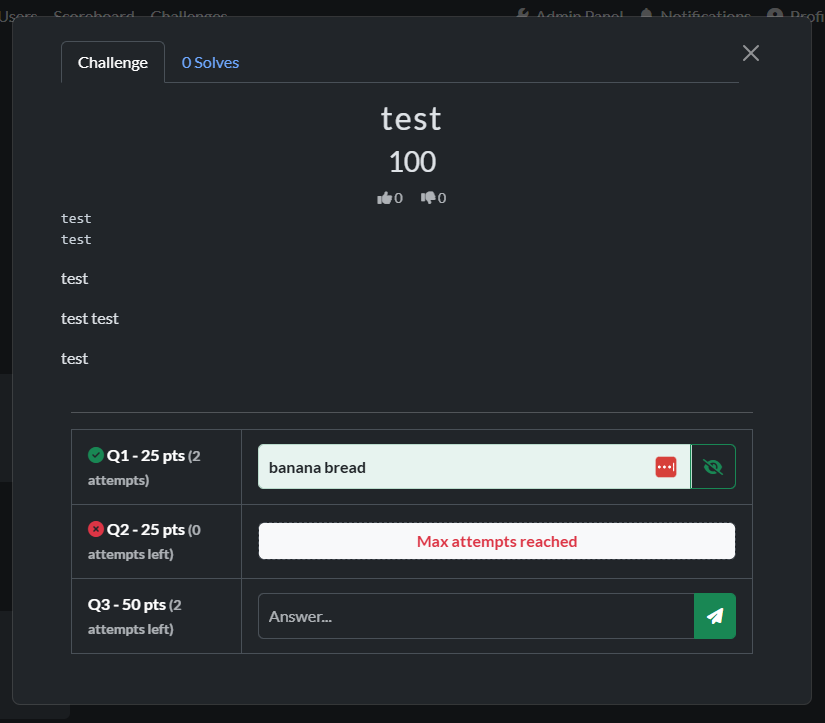

# CTFd Better Answers Plugin



A CTFd plugin that introduces a new challenge type: **Better Answers**. This challenge type allows for multiple questions within a single challenge, each with its own point value and attempt limit.

## Features

- **Multi-Question Table**: Display questions and answer inputs in a clean, Semantic UI-based table.
- **Individual Attempt Limits**: Set custom attempt limits for each question independently.
- **Immediate Partial Credit**: Points are awarded as **Awards** immediately after answering a sub-question correctly.
- **Clean Scoreboard Integration**: Once all questions in a challenge are solved, previous awards are automatically cleaned up and replaced by a single **Solve** record.
- **Secure Answer Viewing**: Correct answers are shown in a password-masked field with a visibility toggle once solved.
- **Flexible Styling**: Supports custom CSS classes per question row (e.g., `TEXT`, `IPv4`).

## Installation

1. Clone or copy this directory into the `CTFd/plugins/` folder of your CTFd installation.
   ```bash
   cd CTFd/plugins/
   git clone https://github.com/kdeary/CTFd-better-answers.git better-answers
   ```
2. Restart your CTFd instance. The plugin will automatically create the necessary database tables upon startup.
3. Log in as an administrator.
4. Go to **Admin Panel** > **Challenges**.
5. Click the **+** button and select **better_answers** as the challenge type.

## How to Use

### Admin Configuration
- After creating a challenge, go to the **Update** tab.
- Use the **Add Question** button to create sub-questions.
- Each question needs:
    - **Title**: (e.g., Q1)
    - **Points**: Individual value for this question.
    - **Max Attempts**: Set to 0 for unlimited attempts.
    - **Description**: The actual question text.
    - **Answer**: The flag for this specific question.

### Scoring Logic
- **Partially Solved**: User receives an `Award` for the points of the specific question.
- **Fully Solved**: Once the last question is answered correctly:
    1. All previous `Awards` for this challenge are deleted.
    2. A standard `Solve` for the challenge is created.
    3. The total points will match the sum of all question points.

## Requirements
- CTFd v3.x (Tested on v3.8.3)
- Semantic UI (Standard CTFd Core icons and components used)
